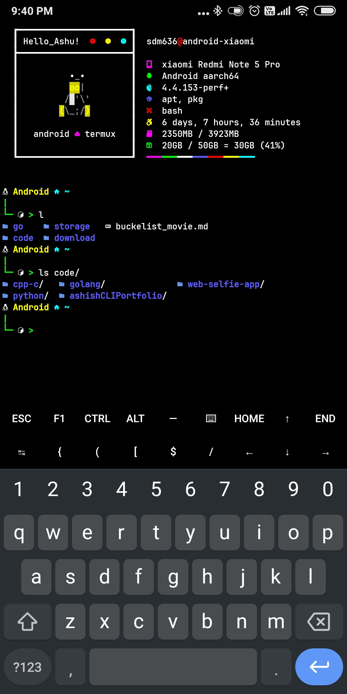

# Termux Dotfile

<kbd></kbd>

This repository contains configuration files and scripts for customizing and optimizing the Termux environment.

## Directory Structure

The repository is organized as follows:
```
.
├── .bashrc
├── .config
│   ├── fastfetch
│   ├── nvim
│   │   ├── init.lua
│   │   ├── lazy-lock.json
│   │   └── lua
│   ├── scripts
│   └── starship.toml
├── .termux
└── assets
```
## Key Software Used

This repository relies on the following software:

1. **[NeoVim](https://neovim.io/)**: A hyperextensible, modern text editor.
2. **[Starship](https://starship.rs/)**: A minimal, blazing-fast, and customizable prompt for any shell.
3. **[Fastfetch](https://github.com/LinusDierheimer/fastfetch)**: A fast and lightweight system information tool.

## How to Use

1. Clone the repository:
   ```bash
   git clone https://github.com/ashudevcodes/termux-dotfile.git
   ```
2. Navigate into the repository:
   ```bash
   cd termux-dotfile
   ```
3. Copy the configuration files to the appropriate locations in your Termux environment.
4. Install the required software listed above.

## TODO 
- write a install script to automate the download and setup
